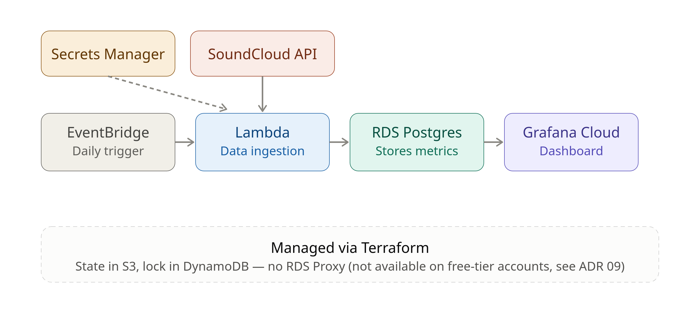

# Music Analytics Platform

Turning my SoundCloud stats into an automated analytics dashboard.

## Table of contents

- [Overview](#overview)
- [Architecture](#architecture)
- [Tech Stack](#tech-stack)
- [Project Structure](#project-structure)
- [Setup / Deployment](#setup--deployment)
- [What this demonstrates](#what-this-demonstrates)
- [Screenshots](#screenshots)
- [License](#license)

---

### Overview

One of my hobbies is mixing electronic music, so I upload my sets to SoundCloud. However, I have no easy way to see how they perform over time. I usually ask myself how plays and engagement change or when might be the best time to release new tracks. This project solves that by fetching my SoundCloud stats daily, storing them and showing them on a dashboard.

It is also a way to apply IaC and AWS serverless architecture to a real problem that I chose myself, rather than a tutorial exercise.

### Architecture



A Lambda function runs the Python code that extracts the data. It is triggered daily by EventBridge, reads the RDS master password from Secrets Manager, and writes the data directly to a PostgreSQL RDS instance. The data is then visualized on a Grafana dashboard.

These resources are created and managed with Terraform. The remote state is stored in S3, with DynamoDB used for state locking.

An earlier version of this architecture included RDS Proxy for connection pooling ([old diagram](./docs/images/architecture-old.png)). It was removed after discovering that it is not available on free-tier AWS accounts. See [ADR 0009](./docs/adr/09-remove-rds-proxy.md) for the full reasoning.

See [docs/adr/](./docs/adr/) for the reasoning behind the architecture decisions, and [docs/notes/](./docs/notes/) for more detailed notes on the Terraform implementation.

### Tech Stack

- **Infrastructure**: Terraform, AWS (Lambda, EventBridge, RDS Postgres)
- **Data Ingestion**: Python (SoundCloud API)
- **Visualization**: Grafana Cloud
- **State Management**: S3 + DynamoDB

### Project Structure

```text
.
├── bootstrap/             # S3 bucket + DynamoDB table for remote state (local state, applied once)
│   └── main.tf
├── modules/
│   ├── lambda_src/        # Python ingestion pipeline (SoundCloud -> RDS)
│   │   ├── script.py
│   │   ├── get_initial_token.py
│   │   ├── test_script.py
│   │   └── requirements.txt
│   └── rds/
│       └── schema.sql     # Database schema (tracks, track_snapshots, account_snapshots)
├── main.tf                # IAM + RDS infrastructure
├── docs/
│   ├── adr/                # Architecture decision records
│   ├── notes/               # Technical study notes (Terraform, etc.)
│   └── images/
├── .github/workflows/     # CI: automated tests + terraform validate on every PR
└── README.md
```

*This tree reflects the current project. It will grow with the `lambda/` module and further modularization.*

### Setup / Deployment

See [docs/runbooks/rds-setup.md](./docs/runbooks/rds-setup.md) for instructions on connecting to RDS and applying the database schema after `terraform apply`.

*(Full deployment instructions will be added once the Lambda + EventBridge module is in place.)*

### What this demonstrates

- OAuth2 authentication with a rotating, single-use refresh token, which needs to be stored between executions (see [ADR 0007](./docs/adr/07-refresh-token.md))
- API integration and data parsing, including handling inconsistent fields such as empty strings
- Idempotent database writes (`ON CONFLICT DO NOTHING`) to safely support re-runs
- Automated testing (pytest) and CI (GitHub Actions) for the ingestion code and Terraform configuration
- Infrastructure as Code with Terraform: remote state (S3 + DynamoDB), least-privilege IAM roles, and a public RDS endpoint restricted by a Security Group
- Adapting an architecture decision after finding a real deployment constraint (RDS Proxy is not available on the free tier - see [ADR 0009](./docs/adr/09-remove-rds-proxy.md))
- Documented architecture decisions and trade-offs (ADRs) throughout the project
- *(To come: event-driven serverless architecture with EventBridge + Lambda, once that module is deployed)*

### Screenshots

### License

This project is licensed under the MIT License. See [LICENSE](./LICENSE) for details.
