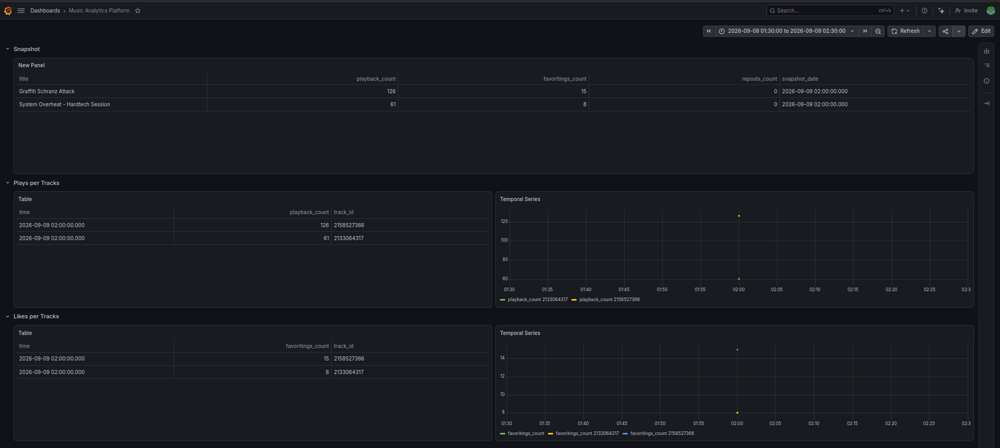
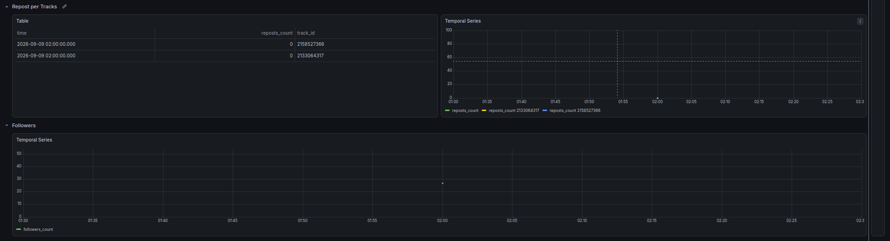

# Music Analytics Platform

Turning my SoundCloud stats into an automated analytics dashboard.

## Table of contents

- [Overview](#overview)
- [Architecture](#architecture)
- [Tech Stack](#tech-stack)
- [Project Structure](#project-structure)
- [Setup / Deployment](#setup--deployment)
- [What this demonstrates](#what-this-demonstrates)
- [Screenshots](#screenshots)
- [License](#license)

---

### Overview

One of my hobbies is mixing electronic music, so I upload my sets to SoundCloud. However, I have no easy way to see how they perform over time. I usually ask myself how plays and engagement change or when might be the best time to release new tracks. This project solves that by fetching my SoundCloud stats daily, storing them and showing them on a dashboard.

It is also a way to apply IaC and AWS serverless architecture to a real problem that I chose myself, rather than a tutorial exercise.

### Architecture


A Lambda function runs the Python code that extracts the data, packaged with its dependencies as a Lambda Layer. It reads SoundCloud credentials from Parameter Store, reads the RDS master password from Secrets Manager, and writes the data directly to a PostgreSQL RDS instance. EventBridge triggers the function once a day. The data is then visualized on a Grafana Cloud dashboard, connected through a dedicated read-only Postgres user.

These resources are created and managed with Terraform. The remote state is stored in S3, with DynamoDB used for state locking.

An earlier version of this architecture included RDS Proxy for connection pooling ([old diagram](./docs/images/architecture-old.png)). It was removed after discovering that it is not available on free-tier AWS accounts. See [ADR 0009](./docs/adr/09-remove-rds-proxy.md) for the full reasoning.

Also worth noting: RDS ingress is open to all IPs on port 5432 for the Lambda, since Lambda does not have a fixed IP outside a custom VPC and a NAT Gateway would add real monthly cost. See [ADR 0010](./docs/adr/10-open-rds-ingress-for-lambda.md). Grafana Cloud's access, on the other hand, is only opened temporarily, right before each demo session, since its published IP ranges can change over time. See [ADR 0008](./docs/adr/08-grafana-network-access.md).

See [docs/adr/](./docs/adr/) for the reasoning behind the architecture decisions, and [docs/notes/](./docs/notes/) for more detailed notes on the Terraform implementation.

### Tech Stack

- **Infrastructure**: Terraform, AWS (Lambda, EventBridge, RDS Postgres)
- **Data Ingestion**: Python (SoundCloud API)
- **Visualization**: Grafana Cloud
- **State Management**: S3 + DynamoDB

### Project Structure

```text
.
├── bootstrap/             # S3 bucket + DynamoDB table for remote state (local state, applied once)
│   └── main.tf
├── modules/
│   ├── lambda_src/        # Python ingestion pipeline (SoundCloud -> RDS)
│   │   ├── script.py
│   │   ├── get_initial_token.py
│   │   ├── seed_parameter_store.py
│   │   ├── test_script.py
│   │   └── requirements.txt
│   └── rds/
│       └── schema.sql     # Database schema (tracks, track_snapshots, account_snapshots)
├── lambda_layer/          # Generated Lambda Layer (dependencies), not committed
├── main.tf                # IAM + RDS + Lambda + EventBridge infrastructure
├── build_layer.sh         # Rebuilds the Lambda Layer zip from requirements.txt
├── init_db.sh             # Applies schema.sql against RDS right after terraform apply
├── init_grafana_user.sh   # Creates the read-only grafanareader Postgres user
├── docs/
│   ├── adr/                # Architecture decision records
│   ├── notes/               # Technical study notes (Terraform, etc.)
│   ├── runbooks/             # Step-by-step operational guides
│   └── images/
├── .github/workflows/     # CI: automated tests + terraform validate on every PR
└── README.md
```

*This tree reflects the current project. It will grow with further modularization into `modules/iam/`, `modules/rds/`, `modules/lambda/`.*

### Setup / Deployment

After `terraform apply`, a few manual steps are needed, since none of this is managed by Terraform itself:

1. Apply the database schema: `./init_db.sh`. See [docs/runbooks/rds-setup.md](./docs/runbooks/rds-setup.md) for the manual step-by-step version.
2. Create the read-only Grafana user and connect the dashboard: `./init_grafana_user.sh`, then follow [docs/runbooks/grafana-setup.md](./docs/runbooks/grafana-setup.md).
3. Make sure SoundCloud credentials are in Parameter Store: `modules/lambda_src/seed_parameter_store.py`.

Before applying the Lambda module, rebuild the Layer if dependencies changed: `./build_layer.sh`. The CI workflow also rebuilds the Layer before running `terraform validate`, since the generated `lambda_layer/layer.zip` file is not committed to Git.

Once deployed, EventBridge triggers the ingestion Lambda automatically once a day, no manual invocation needed.

### What this demonstrates

- OAuth2 authentication with a rotating, single-use refresh token, which needs to be stored between executions (see [ADR 0007](./docs/adr/07-refresh-token.md))
- API integration and data parsing, including handling inconsistent fields such as empty strings
- Idempotent database writes (`ON CONFLICT DO NOTHING`) to safely support re-runs
- Automated testing (pytest) and CI (GitHub Actions) for the ingestion code and Terraform configuration
- Infrastructure as Code with Terraform: remote state (S3 + DynamoDB), least-privilege IAM roles, a Lambda function with a dependencies Layer, EventBridge scheduling, and a public RDS endpoint
- Credential management split across Parameter Store (SoundCloud, free) and Secrets Manager (RDS, auto-generated), rather than defaulting to one service for everything
- A dedicated read-only database user for the Grafana dashboard, instead of reusing the RDS master user (see [ADR 0011](./docs/adr/11-grafana-read-only-user.md))
- Adapting architecture decisions after finding real deployment constraints (RDS Proxy unavailable on the free tier, Lambda's lack of a fixed IP forcing open RDS ingress), see [ADR 0009](./docs/adr/09-remove-rds-proxy.md) and [ADR 0010](./docs/adr/10-open-rds-ingress-for-lambda.md)
- Documented architecture decisions and trade-offs (ADRs) throughout the project

### Screenshots





### License

This project is licensed under the MIT License. See [LICENSE](./LICENSE) for details.
